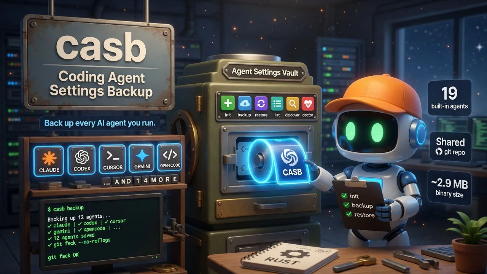

# casb — Coding Agent Settings Backup

<div align="center">
  
</div>

<div align="center">


</div>

**Back up, version, and restore configuration for 19 AI coding agents — in Rust.**  
Claude Code, Codex, Cursor, Gemini, OpenCode, and 14 more. One shared git repo, `--json` for agents, full version history.

<div align="center">

```bash
curl -fsSL "https://raw.githubusercontent.com/quangdang46/coding_agent_settings_backup/main/install.sh?$(date +%s)" \
  | bash -s -- --easy-mode
```

</div>

---

## 🤖 Agent Quickstart (Robot Mode)

⚠️ Always use `--json` in agent contexts. Never scrape human text output.

```bash
# Snapshot all installed agents
casb backup --json

# See backup state (installed, backed up, missing)
casb list --json

# Restore a specific agent
casb restore claude --json

# Health check
casb doctor --json
```

**Output conventions**
- stdout = structured data (JSON)
- stderr = diagnostics, warnings
- exit 0 = success, exit 1 = errors found

---

## TL;DR

### The Problem

Every coding agent stores its configuration somewhere different. Claude Code uses 3 directories, Codex and Gemini use their own, OpenCode has 2, and each one gets lost when you reinstall or migrate machines. Six months of agent tuning — custom instructions, provider keys, tool preferences — disappears in a format-and-reinstall.

Manual backups are inconsistent. Per-agent `.git` folders sprawl. And when something breaks, you have no idea which backup contains the config you need.

### The Solution

`casb` discovers every installed AI agent on your machine, backs up all their config directories into a **single shared git repository**, and gives you tags, history, diff, and restore — from one CLI. Nineteen agents supported out of the box, multi-location merging for agents with scattered config dirs, and SQLite state databases included.

### Why casb?

| Feature | What it does |
|---------|--------------|
| **19 agents, one repo** | Claude, Codex, Cursor, Gemini, OpenCode, Cline, Aider, Copilot, and 11 more — all under `~/.agent_settings_backups/.git` |
| **Multi-location merge** | Agents with 2–3 config dirs get merged into a single backup commit |
| **Machine-readable** | `--json` and `--format toon` for coding agents |
| **Parallel backup** | `casb backup --parallel` runs agents concurrently |
| **Diff & history** | See what changed per agent between backups |
| **Export / Import** | `tar.gz` archives with stdin/stdout pipe for migrations |
| **Doctor** | Health checks for git, rsync, disk, config, and per-repo `git fsck` |
| **Schedule** | `systemd` timers or `cron` — automated daily/weekly |
| **Shell completion** | bash, zsh, fish |
| **No `git2` / no `libgit2`** | Pure `std::process::Command` — ~2.9 MB binary, fast compile |

### How casb Compares

| Capability | casb | Manual tar/cp | Per-agent git repos | Cloud sync (iCloud, rsync) |
|-----------|------|--------------|---------------------|---------------------------|
| **Agents auto-detected** | ✅ 19 built-in | ❌ Manual list | ❌ Per-agent setup | ❌ All-or-nothing |
| **Shared git repo** | ✅ Single `.git` | ❌ Per-folder | ❌ Per-agent `.git` sprawl | ❌ Not versioned |
| **Multi-location merge** | ✅ Claude=3 dirs merged | ❌ Manual merge | ❌ Split repos | ❌ Split folders |
| **Diff per agent** | ✅ `casb diff` | ❌ Manual | ✅ Per-repo | ❌ |
| **Export pipe** | ✅ stdin/stdout `tar.gz` | ✅ tar czf | ❌ | ❌ |
| **JSON output** | ✅ `--json` | ❌ | ❌ | ❌ |
| **Binary size** | ~2.9 MB | N/A | ~50 MB+ with git2 | N/A |

---

## Quick Example

```bash
# One-time setup
casb init

# Back up everything
casb backup                    # all 19 agents
casb backup claude codex       # specific agents only
casb backup --parallel         # concurrent

# See what's installed and backed up
casb list
casb history claude
casb diff claude

# Restore
casb restore claude            # latest backup
casb restore claude v1.0       # tagged backup

# Machine-readable
casb list --json
casb doctor --json

# Migrate machines
casb export claude - | ssh new-machine "casb import -"
```

---

## Design Philosophy

| Principle | Rationale |
|-----------|-----------|
| **One repo to rule them all** | A single shared git repository eliminates per-agent `.git` sprawl and makes cross-agent restores atomic |
| **Auto-discovery over config** | Nineteen agents detected automatically; no manual `settings.json` |
| **Machine-readable first** | `--json` and `--format toon` so agents can inspect backup state without scraping |
| **Safe by default** | `--dry-run`, `--force`, atomic writes, backup verification, pre/post hooks |
| **No heavy dependencies** | `std::process::Command` for git — no `git2`/`libgit2`, ~2.9 MB binary |

---

## Installation

```bash
# macOS / Linux — curl pipe
curl -fsSL "https://raw.githubusercontent.com/quangdang46/coding_agent_settings_backup/main/install.sh?$(date +%s)" | bash

# Windows PowerShell
irm "https://raw.githubusercontent.com/quangdang46/coding_agent_settings_backup/main/install.ps1" | iex

# From source
cargo install --git https://github.com/quangdang46/coding_agent_settings_backup --locked
```

---

## Commands

| Command | Description |
|---------|-------------|
| `init` | Initialize backup root directory |
| `backup [AGENTS...]` | Back up one or more agents (all if unspecified) |
| `restore <AGENT> [REF]` | Restore from backup commit or tag |
| `export <AGENT> [FILE]` | Export as `tar.gz` (`-` for stdout) |
| `import [FILE]` | Import from `tar.gz` (`-` for stdin) |
| `list` | Show every agent and install status |
| `history <AGENT>` | Backup history for an agent |
| `diff <AGENT>` | Changes since latest backup |
| `tag` | Manage backup tags (create/list/delete) |
| `verify [AGENTS...]` | `git fsck` integrity checks |
| `stats [AGENT]` | Repo size, commit count, source size |
| `discover` | Scan for newly installed AI agents |
| `schedule` | Manage automated backup schedules |
| `hooks` | List configured hook scripts |
| `config` | Get/set configuration values |
| `doctor` | Health check diagnostics |
| `completion <SHELL>` | Generate shell completion (bash/zsh/fish) |

### Supported agents (19 built-in)

`claude` `codex` `cursor` `gemini` `cline` `amp` `aider` `opencode` `factory` `windsurf` `plandex` `qwencode` `amazonq` `kiro` `continue` `copilot` `zed` `roo` `trae`

---

## Configuration

```toml
[general]
backup_root = "~/.agent_settings_backups"
auto_commit = true
output_format = "text"

[backup]
exclusions = ["*.log", "*.tmp", "**/cache/**", "*.sqlite3-wal*"]
use_rsync = true
checksum_verify = false

[schedule]
method = "systemd"    # systemd | cron | none
interval = "daily"    # hourly | daily | weekly
```

| Env var | Maps to |
|---------|---------|
| `CASB_BACKUP_ROOT` | `general.backup_root` |
| `CASB_OUTPUT_FORMAT` | `general.output_format` |
| `CASB_CONFIG` | Config file path override |

---

## Troubleshooting

| Symptom | Cause | Fix |
|---------|-------|-----|
| `casb backup` finds no agents | Agents not installed in standard paths | Run `casb discover` to scan custom locations |
| `restore` fails with "repo not found" | `init` not run yet | `casb init` first |
| `doctor` reports git errors | Backup repo corrupted | `casb verify --fix` or delete `.agent_settings_backups` and re-init |
| Parallel backup slow | Too many agents + I/O contention | Reduce count with specific agent names |
| Export pipe breaks | Stdout consumed by non-pipe context | Use `casb export agent file.tar.gz` for file output |

---

## Limitations

| Edge case | Reality |
|-----------|---------|
| **Agent coverage** | 19 built-in agents — not every CLI tool on earth. `discover` helps find custom ones |
| **No cloud sync** | casb is local-first. Export/import for migration; no built-in push to S3/Backblaze |
| **git required** | Relies on `git` in PATH. If git is absent, backup falls back to file copy (no versioning) |
| **SQLite WAL exclusion** | `*.sqlite3-wal` / `*.sqlite3-shm` are excluded — they are temp files, not the DB itself |

---

## FAQ

### Does casb back up API keys?

It backs up whatever is in the agent's config directory. If keys are in config files (not env vars), they get backed up. Use `.casbignore` to exclude sensitive paths.

### Can I restore to a different machine?

Yes — `casb export agent - | ssh new "casb import -"`. The target machine doesn't need the same agents installed for import.

### What if an agent has config in 3 directories?

casb merges all locations into one backup commit per agent. Supported multi-location agents: Claude (3), OpenCode (2), Cline (2).

### Does casb work without git?

It degrades gracefully — backup falls back to file copy with no version history. All other commands warn that git is missing.

### How often should I run it?

Daily via `casb schedule`. Or hook it into your shell's `precmd` / `zsh_prompt` for per-session backups.

---

<div align="center">
  <sub>Built with Rust. Powered by Git. Backed up daily.</sub>
</div>
